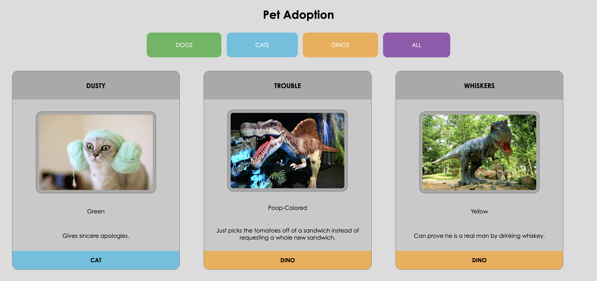

# pet-adoption

## Description
This project is an exploration of vanilla css focusing on flexbox and using the DOM to manipulate our html in order to dynamically create content on our page. We wrote all code from scratch to achieve a uniform look for the cards on the page, which displays pets that are available for adoption. You can filter through these pets by using the buttons at the top of the page, which will give you only dogs, only cats, or only dinos according the choice you make.

## Screenshots

## Instructions / How to Run
1. Clone down this repo
2. Make sure you have http-server installed via npm. If not get it here [HERE](https://www.npmjs.com/package/http-server)
3. On your command line run `hs -p 9999`
4. In your browser go to `http://localhost:9999`